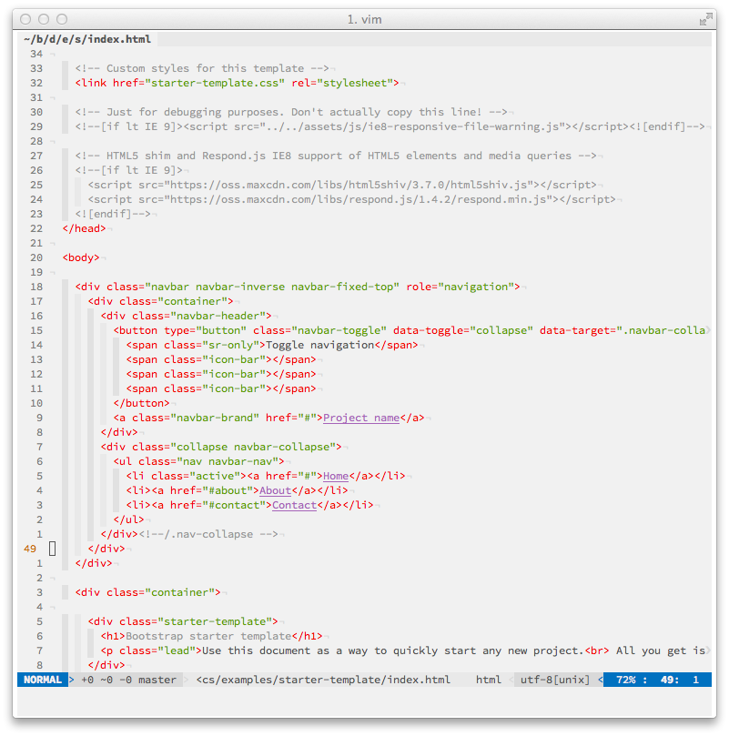

genomA-Vim
=====

Vim custom configuration built for interface web developers and web designers, with a small but functional set of plugins.

_This is basically a backup of my own Vim configuration, you can use it, fork it, modify to your own tastes._

The aim of this Vim setup is to be as functional as possible, using the built-in Vim plugin **netrw**.

# INFORMATIONS

This setup has been tested with Vim compiled from source with **lua**, latest iTerm2 nightly build and Homebrew on OSX.

## BASIC STEPS

### Homebrew
Download **Homebrew** from [this link](http://brew.sh/) and follow the instructions.

Install **the_silver_searcher**

`$ brew install the_silver_searcher`
`$ brew install lua`

### VIM
Clone the official repository

`$ hg clone https://vim.googlecode.com/hg/ vim`

`$ hg pull`

`$ hg update`

Compile the source

`./configure --enable-multibyte --with-tlib=ncurses --enable-luainterp --enable-cscope --with-features=huge --enable-rubyinterp --enable-pythoninterp --enable-gui=no --without-x`

`$ make && make install`

### Clone this repository and vundle in your home directory

`git clone https://github.com/genoma/g-vim.git .vim`

`$ git clone https://github.com/gmarik/vundle.git ~/.vim/bundle/vundle`

Link the vimrc to ~/.vimrc

`ln -s ~/.vim/vimrc ~/.vimrc`

#### Start vim and launch
`:BundleInstall`

# PLUGINS

- gmarik/vundle

- bling/vim-airline
- chriskempson/vim-tomorrow-theme
- csscomb/csscomb-for-vim
- gcmt/wildfire.vim
- groenewege/vim-less
- kchmck/vim-coffee-script
- kshenoy/vim-signature
- Lokaltog/vim-easymotion
- mattboehm/vim-accordion
- mattn/emmet-vim
- mbbill/undotree
- mhinz/vim-signify
- nathanaelkane/vim-indent-guides
- ntpeters/vim-better-whitespace
- plasticboy/vim-markdown
- Raimondi/delimitMate
- rking/ag.vim
- tomtom/tcomment_vim
- tpope/vim-fugitive
- tpope/vim-sensible
- tpope/vim-surround
- tpope/vim-unimpaired

- ervandew/supertab

####Read carefully the vimrc for shortcuts and configurations.

# LICENSE
The MIT License (MIT)

Copyright (c) 2014 Alessandro Vioni

Permission is hereby granted, free of charge, to any person obtaining a copy of
this software and associated documentation files (the "Software"), to deal in
the Software without restriction, including without limitation the rights to
use, copy, modify, merge, publish, distribute, sublicense, and/or sell copies of
the Software, and to permit persons to whom the Software is furnished to do so,
subject to the following conditions:

The above copyright notice and this permission notice shall be included in all
copies or substantial portions of the Software.

THE SOFTWARE IS PROVIDED "AS IS", WITHOUT WARRANTY OF ANY KIND, EXPRESS OR
IMPLIED, INCLUDING BUT NOT LIMITED TO THE WARRANTIES OF MERCHANTABILITY, FITNESS
FOR A PARTICULAR PURPOSE AND NONINFRINGEMENT. IN NO EVENT SHALL THE AUTHORS OR
COPYRIGHT HOLDERS BE LIABLE FOR ANY CLAIM, DAMAGES OR OTHER LIABILITY, WHETHER
IN AN ACTION OF CONTRACT, TORT OR OTHERWISE, ARISING FROM, OUT OF OR IN
CONNECTION WITH THE SOFTWARE OR THE USE OR OTHER DEALINGS IN THE SOFTWARE.
